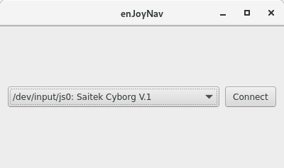
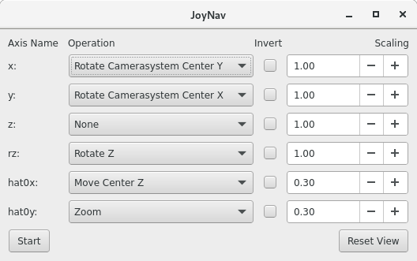

# FreeCAD-Macro-JoyNav

[](http://www.gnu.org/licenses/lgpl-3.0)

Navigate in FreeCAD using a USB joystick (Linux only!)

## Motivation

I started working on this project because using my USB mouse to navigate in FreeCAD was extremely tedious. When I finally freed my USB joystick from the dust it collected over the past years, I started coding. Three days later this project is what I came up with.

## Current State of Development

The project is still in its early stages. You will definitely find bugs. Additionally the macro can currently only be used in the orthographic view. The operations class was intentionally modularized to simplify adding new rotation/ translation operations. If you found a useful new transformation, just submit a new pull request.

## Screenshots





## Installation

If you still want to risk losing your orientation in the 3D view of FreeCAD follow the steps below to "install" the macro:

```bash
cd /path/you/like
git clone git@github.com:yozoon/FreeCAD-Macro-JoyNav.git
cd FreeCAD-Macro-JoyNav
ln -s /path/you/like/FreeCAD-Macro-JoyNav/JoyNav.py ~/.FreeCAD/Macro/JoyNav.py
ln -s /path/you/like/FreeCAD-Macro-JoyNav/modules ~/.FreeCAD/Macro/modules
```
